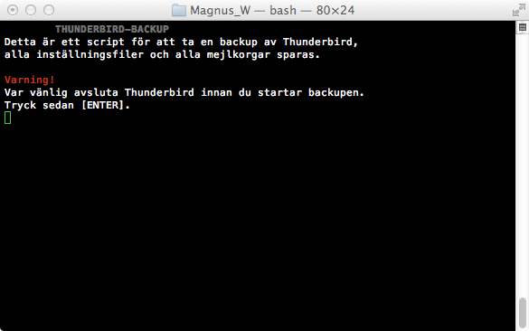
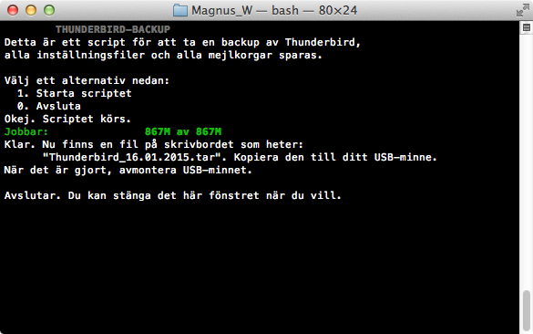
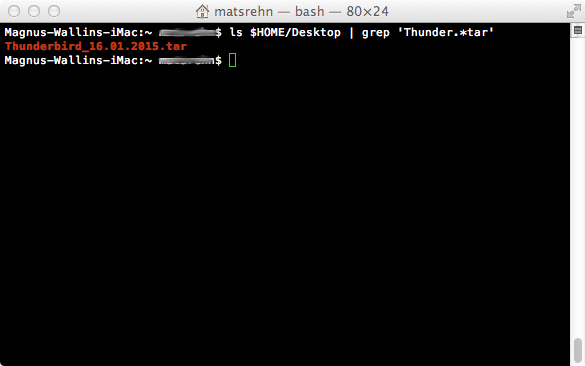

# TB_backup
Backup solution for Thunderbird e-mail client (macOS). 
Written for Swedish clients. Hence all output to `stdout` is in Swedish!

<h2>Screenshots</h2>
**Ex. 1:** 
Stop if Thunderbird is running. We don't want a corrupted `Profiles` directory

**Ex. 2:** 
Normal execution

**Ex. 3:** 
Result

